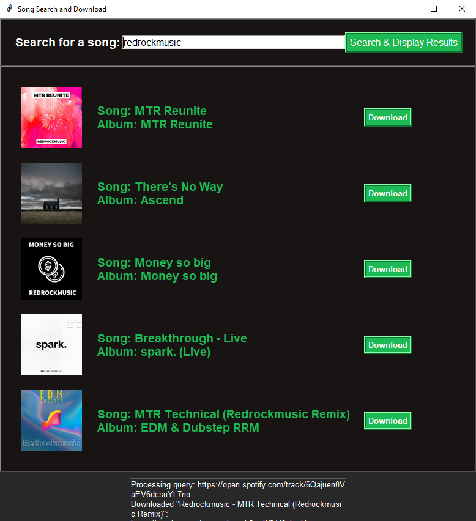
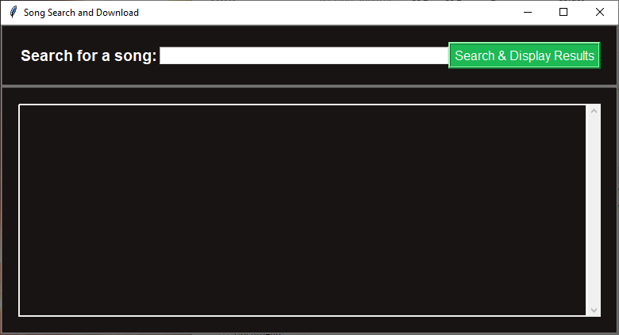
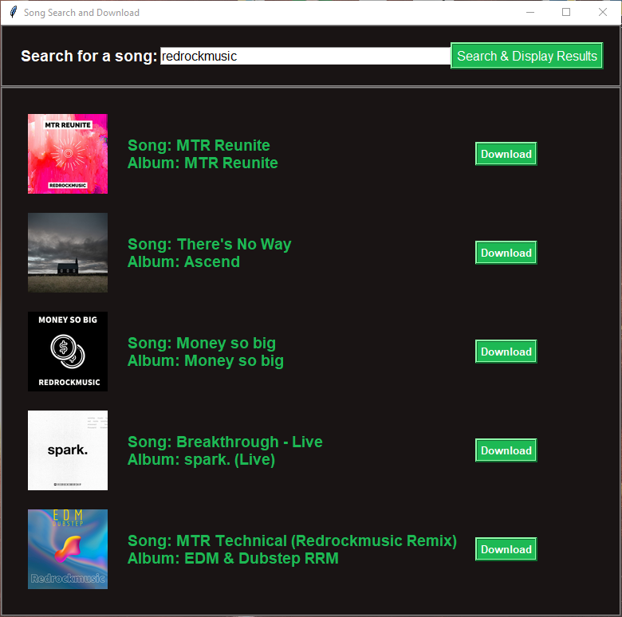

# SpotiDownloader (Music Search) ReadMe

Welcome to SpotiDownloader, your go-to solution for searching and downloading high-quality music effortlessly. Whether you're an avid music enthusiast or simply looking for a convenient way to enjoy your favorite tunes, SpotiDownloader has you covered. With its robust set of features, you can seamlessly search for, download, and enjoy music, all while maintaining exceptional audio quality and complete metadata.

## Features

### Music Search
SpotiDownloader empowers you with a comprehensive music search functionality, allowing you to explore a vast library of tracks, albums, and artists. Say goodbye to endless scrolling – simply enter your search queries, and let the software work its magic.

### High-Quality Downloads
We understand the importance of pristine audio quality. That's why SpotiDownloader ensures that each music file you download is of the highest caliber, clocking in at an impressive 320kbps. Immerse yourself in the richness of your favorite songs, as if the artists were performing right in front of you.

### Metadata Included
No more missing details or incomplete track information. SpotiDownloader takes care of everything. Each downloaded music file comes complete with its metadata intact, ensuring that you have access to essential information such as song title, artist, album, and even cover art.

## Getting Started (SOON)

To experience the magic of SpotiDownloader, follow these simple steps:

1. **Installation:** Clone the repository and install the required dependencies as outlined in the provided documentation.

2. **Usage:** Launch SpotiDownloader and explore its intuitive interface. Use the powerful search feature to find the music you desire.

3. **Downloading:** Once you've found the perfect track, initiate the download process. Sit back and let SpotiDownloader work its magic, providing you with a high-quality audio file enriched with metadata.

## Learn More

Want to delve deeper into SpotiDownloader's capabilities or join a community of like-minded music enthusiasts? Feel free to check out our Discord server: [SpotiDownloader Discord](https://discord.gg/B7apjZHRAd). Here, you can connect with other users, exchange tips and tricks, and stay updated on the latest feature enhancements and announcements.

## Preview

## Contribute

We believe in the power of open source and welcome contributions from the community. If you're a developer looking to improve SpotiDownloader, don't hesitate to fork the repository, make your enhancements, and submit a pull request (remember to message me on discord). Together, we can create the ultimate music search and download tool.

## Support

Encountering issues or have questions? Reach out to our dedicated support team on discord [SpotiDownloader Discord](https://discord.gg/B7apjZHRAd). We're here to ensure your SpotiDownloader experience is as smooth as your favorite melodies.

## License

SpotiDownloader is released under the [MIT License](https://opensource.org/licenses/MIT). Feel free to use, modify, and distribute in accordance with the terms of the license.

---

Experience music like never before with SpotiDownloader. Discover, download, and delight in your favorite tracks with unparalleled audio quality and complete metadata. Your musical journey starts here.
